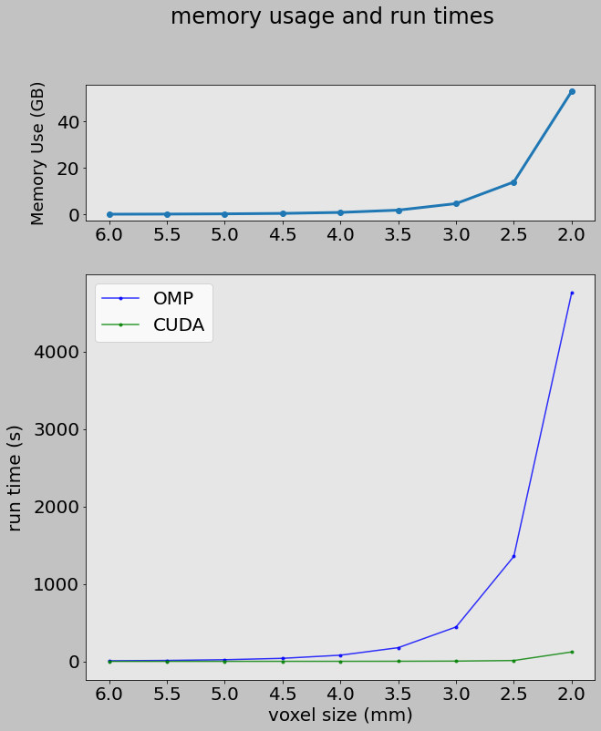

# cudaCC 

Calculates cross-correlation based distances of all voxels within a mask and
outputs the full 2D distance matrix.

Uses CUDA implementation to speed up the process.

# Setup

The projects uses cmake for compilation, so just call cmake using the included
CMakeLists.txt.

## Requirements

This projects uses nifticlib-2.0.0 for nifti-io interface. It is included in the
project and is precompiled but should be recompiled when moving the project onto
a new system just in case.

# Usage

        ./cudaCC <input.nii> <mask.nii> <outout.txt>

# Warnings

* The program is bare-bones and do not have much sanity-checking if at
all, so it is up the user to make sure \<mask.nii\> has the same volume
dimensions (and in the same space) as \<input.nii\>, and your system must have
sufficient memory (both CPU and GPU) to handle the task at hand.

* This program requires significant amounts of memory to run. Note
that the program requires sufficent memory to buffer the entire 2D matrix prior
to exporting.

* This program (currently) do not support computation of the distance
matrix in parts, so the full (upper triangular without dignal) matrix is
computed, and requires sufficient GPU memory to do so.

## Details

C/C++ CUDA program to compute the cross-correlation based distance matrix of a
input \*.nii file and a correpsonding binary mask (also \*.nii). Computes
voxel-wise distances of all voxels of the input voxels within the binary mask.

Uses 2D CUDA kernel and internally only computes the upper triangular matrix
without the diagonal.

Outputs text file of the full 2D matrix, including the diagonal, which is forced
to be 0. Since only half of the matrix is actually computed, its symmetrical
other half is inferred and is hence guaranteed to be symmetrical and Hermitian.

Spatial ordering of the voxels follows the i-j-k ordering of AFNI's 3d...dump
programs (i.e where `input[time][k][j][i]`) where the LAST index is iterated
first, followed by second to last, and finally then the second index. This is
done so that  AFNI's *3dUndump* can be easily used to convert the matrix back to
a \*.nii file if desired.

# Performance

A pure 2D CUDA C kernel is expected to perform great, and it does.

| Resolution(mm) | nr. voxels | memory (GPU, GB) | omp | cuda |
| -------------- | ---------- | ---------------- | --- | ---- |
| 6.0            | 6267       | 0.07             | 7s, 12ms          | 51ms               |
| 5.5            | 8088       | 0.12             | 11s, 904ms        | 85ms               |
| 5.0            | 10935      | 0.22             | 21s, 170ms        | 149ms              |
| 4.5            | 14856      | 0.41             | 39s, 180ms        | 279ms              |
| 4.0            | 21081      | 0.83             | 1min, 19s, 477ms  | 584ms              |
| 3.5            | 31260      | 1.82             | 2min, 56s, 363ms  | 1s, 220ms          |
| 3.0            | 49877      | 4.63             | 7min, 23s, 851ms  | 3s, 143ms          |
| 2.5            | 86551      | 13.95            | 22min, 36s, 103ms | 10s, 892ms         |
| 2.0            | 168648     | 52.98            | 79min, 20s, 729ms | 2min, 1s, 451ms[¹] |

Note that the CPU OMP implementation is tested on a Ryzen 9 5950x 16core (32
thread) processor which is capable of boosting to 4.0Ghz with 64GB of RAM and
the GPU is a Nivida RTX4090 with 24GB of memory running on Cuda 12.5 with driver
version 555.42.02. Cuda timings include copying data from device to host memory
(but not host to device prior to deploying kernel). 

[¹]For 2mm timings, CUDA implementation is forced to split the job into blocks
to fit onto device memory, and hence timings is slightly different, as it
includes allocation and copying data between host and device memory, and piecing
together the final results (also includes excessive debug message outputs!).
Note that just saving the file to a SATA SSD took 30 minutes and 41s, so timing
errors in seconds is the least of your problems in this case.

# Testing

*calcCC_cuda* is also available to check the results, which calculates the
cross-correlation matrix (i.e. not distance) using both CUDA and CPU based
implementation optimized with OMP. The program then cross-checks the two results
and, if successful, will output the CUDA implementation results. Usage and
details are otherwise the same as *cudaCC*.

